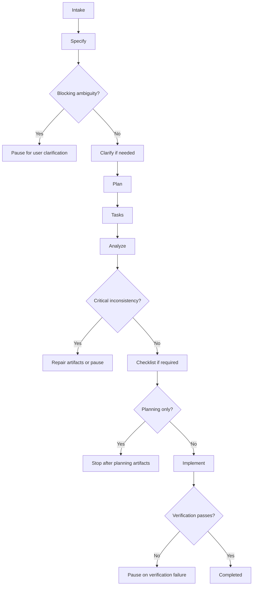
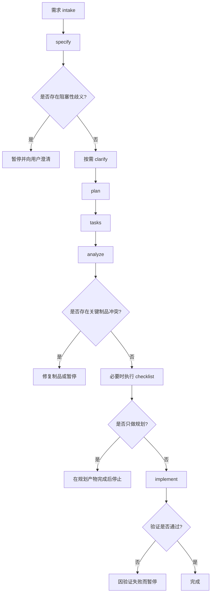

# speckit-pipeline

English | [中文](#中文说明)

`speckit-pipeline` is a Codex skill that orchestrates one concrete feature through the Spec Kit workflow in a disciplined, gated order.

It is intentionally narrow: one feature, one pipeline, one set of gates. It does not replace the official Spec Kit skills. It coordinates them.

## What It Does

- Runs one feature through `specify`, `clarify`, `plan`, `tasks`, `analyze`, `checklist`, and `implement`
- Treats artifact consistency and verification as real gates
- Stops only for true blockers such as missing prerequisites, unresolved ambiguity, conflicting artifacts, or failed verification
- Produces stage-based progress reporting instead of vague orchestration summaries

## When to Use It

Use this skill when:

- the repository already uses Spec Kit
- the user wants one feature executed end-to-end with less manual step switching
- the user wants planning plus implementation, or planning-only with a clean stop before implementation

Do not use it for:

- backlog prioritization across multiple features
- roadmap planning
- release management
- multi-PR orchestration
- repo-wide tech-debt programs

## Dependencies

This skill assumes the repository already has the official Spec Kit skills available:

- `$speckit-constitution`
- `$speckit-specify`
- `$speckit-clarify`
- `$speckit-plan`
- `$speckit-tasks`
- `$speckit-analyze`
- `$speckit-checklist`
- `$speckit-implement`

## Repository Layout

- `SKILL.md`: core skill instructions
- `agents/openai.yaml`: Codex UI metadata
- `references/gating-rules.md`: gate definitions and completion criteria

## Install

Copy this directory into your Codex environment skills directory:

```bash
mkdir -p "${CODEX_HOME:-$HOME/.codex}/skills/speckit-pipeline"
cp -R ./* "${CODEX_HOME:-$HOME/.codex}/skills/speckit-pipeline/"
```

Then restart Codex.

## Example Prompts

```text
Use $speckit-pipeline to implement this feature end-to-end.
Use $speckit-pipeline to plan this feature but stop before implementation.
Use $speckit-pipeline to run one feature through the full workflow and pause only on blocking gates.
```

## Pipeline Flow



## Design Principles

- One feature only
- Stage order is mandatory
- Blocking gates are real
- Verification is required before claiming completion
- Output should always tell the user the current stage, artifacts, assumptions, blockers, and next step

## License

This project is licensed under the Apache License 2.0. See `LICENSE`.

## 中文说明

`speckit-pipeline` 是一个 Codex skill，用来把一个具体功能按照 Spec Kit 的标准流程串起来执行。

它的定位非常克制：一次只处理一个功能，不替代官方 Spec Kit skills，而是把这些 skills 按照有门禁的顺序组织起来，减少手工一步一步触发的负担。

### 它解决什么问题

- 把单个功能按 `specify -> clarify -> plan -> tasks -> analyze -> checklist -> implement` 的顺序推进
- 把制品一致性检查和验证结果当成真正的门禁
- 遇到阻塞问题时暂停，而不是继续带着错误往下放大
- 每个阶段都输出明确状态，而不是只给模糊总结

### 适用场景

适合：

- 仓库已经接入 Spec Kit
- 你想把一个功能从需求推进到实现
- 你希望减少人工切换多个 skill 的步骤

不适合：

- 多功能排期和优先级管理
- 路线图规划
- 发布编排
- 多 PR 协调
- 仓库级长期技术债治理

### 依赖

这个 skill 依赖仓库中已经存在官方 Spec Kit skills：

- `$speckit-constitution`
- `$speckit-specify`
- `$speckit-clarify`
- `$speckit-plan`
- `$speckit-tasks`
- `$speckit-analyze`
- `$speckit-checklist`
- `$speckit-implement`

### 仓库结构

- `SKILL.md`：skill 核心规则
- `agents/openai.yaml`：Codex UI 元数据
- `references/gating-rules.md`：门禁规则和完成条件

### 安装方式

把当前目录复制到 Codex 环境级 skills 目录：

```bash
mkdir -p "${CODEX_HOME:-$HOME/.codex}/skills/speckit-pipeline"
cp -R ./* "${CODEX_HOME:-$HOME/.codex}/skills/speckit-pipeline/"
```

然后重启 Codex。

### 流程图



### 设计原则

- 一次只处理一个功能
- 阶段顺序不能跳
- 阻塞门禁必须真实生效
- 没有验证结果不能宣称完成
- 每次输出都要包含当前阶段、产物、假设、阻塞和下一步
