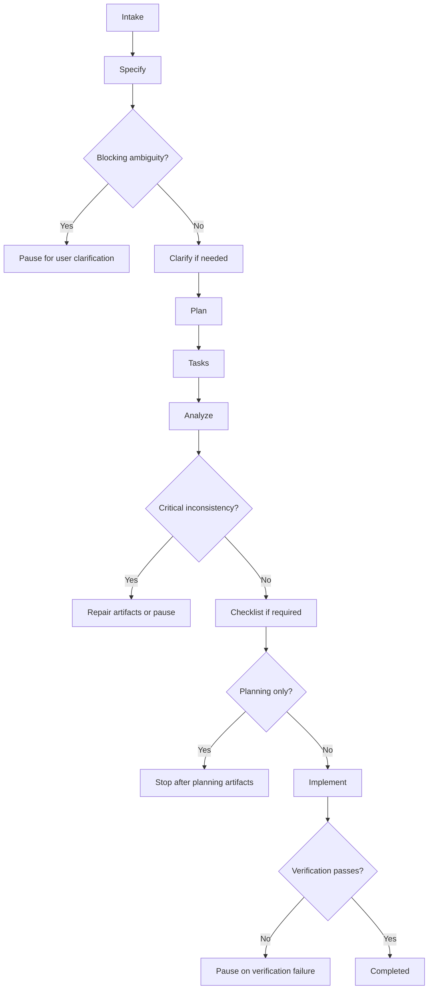
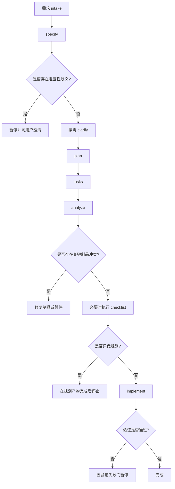

# speckit-pipeline

English | [中文](#中文说明)

`speckit-pipeline` runs one concrete feature through the Spec Kit workflow in a disciplined, gated order. Starting with v0.2.0, it can be installed into projects for Codex, Claude Code, Qoder, and Cursor so teams can switch tools without losing workflow state.

It does not replace official Spec Kit commands or skills. It coordinates them and records progress in repository files.

## What It Does

- Runs one feature through `specify`, `clarify`, `plan`, `tasks`, `analyze`, `checklist`, and `implement`
- Supports Codex, Claude Code, Qoder, and Cursor wrappers
- Distinguishes a new feature request from resuming an interrupted feature
- Stores handoff state in `specs/<feature>/.speckit-pipeline-state.json`
- Treats artifact consistency and verification as real gates
- Avoids `specify integration switch` so multiple tools can share one project safely

## When to Use It

Use `speckit-pipeline` when:

- the repository already uses Spec Kit
- the user wants one concrete feature developed from request to implementation
- the user wants planning plus implementation, or planning-only with a clean stop before implementation
- the work may need to resume later in another AI coding tool

Do not use it for:

- backlog prioritization across multiple features
- roadmap planning
- release management
- multi-PR orchestration
- repo-wide tech-debt programs

## Prerequisites

The target project should already be initialized for Spec Kit and should contain the official Spec Kit stage artifacts for the tool you want to use.

The pipeline coordinates these stages:

- `specify`
- `clarify`
- `plan`
- `tasks`
- `analyze`
- `checklist`
- `implement`

It does not run `specify init`, `specify integration switch`, or mutate `.specify/integration.json`.

## Install

v0.2.0 uses POSIX shell scripts and supports macOS/Linux.

From a checkout of this repository:

```bash
./bin/speckit-pipeline install --tool codex --project /path/to/project
./bin/speckit-pipeline install --tool qoder --project /path/to/project
./bin/speckit-pipeline install --tool all --project /path/to/project
```

From GitHub:

```bash
curl -fsSL https://raw.githubusercontent.com/TechZi/speckit-pipeline/main/install.sh | bash -s -- --tool all --project /path/to/project
```

To install from a specific branch or tag, set `SPECKIT_PIPELINE_REF`:

```bash
curl -fsSL https://raw.githubusercontent.com/TechZi/speckit-pipeline/main/install.sh | SPECKIT_PIPELINE_REF=v0.2.0 bash -s -- --tool codex --project /path/to/project
```

`--project` defaults to the current directory.

## Tool Invocation

After installation, invoke the wrapper supported by your current AI coding tool:

```text
Codex:  $speckit-pipeline <request>
Claude: /speckit-pipeline <request>
Qoder:  /speckit-pipeline <request>
Cursor: /speckit-pipeline <request>
```

Example prompts:

```text
$speckit-pipeline implement this feature end-to-end: <feature request>
$speckit-pipeline plan this feature but stop before implementation: <feature request>
$speckit-pipeline continue the current feature
/speckit-pipeline resume
```

## New vs Resume

The pipeline starts a new feature when the user provides a concrete new feature request or explicitly says to start/create/build/implement a new feature.

The pipeline resumes when the user asks to continue/resume/接着/继续/恢复 or when no new feature request is present and an incomplete feature state exists.

If an incomplete feature exists and the user input also looks like a new request, the pipeline pauses and asks whether to resume the existing feature or start a new one.

## Pipeline Flow


```mermaid
flowchart TD
    A[Intake] --> B[Specify]
    B --> C{Blocking ambiguity?}
    C -- Yes --> C1[Pause for user clarification]
    C -- No --> D[Clarify if needed]
    D --> E[Plan]
    E --> F[Tasks]
    F --> G[Analyze]
    G --> H{Critical inconsistency?}
    H -- Yes --> H1[Repair artifacts or pause]
    H -- No --> I[Checklist if required]
    I --> J{Planning only?}
    J -- Yes --> J1[Stop after planning artifacts]
    J -- No --> K[Implement]
    K --> L{Verification passes?}
    L -- No --> L1[Pause on verification failure]
    L -- Yes --> M[Completed]
```

## Stage Behavior

The pipeline is intentionally narrow: one feature, one stage order, one set of gates.

- `intake`: interpret the user's request as one concrete feature
- `specify`: run the official Spec Kit specification stage and record the feature directory
- `clarify`: resolve material ambiguity before planning; skip only when assumptions are safe
- `plan`: generate the technical plan against the real repository constraints
- `tasks`: create dependency-aware implementation tasks
- `analyze`: check cross-artifact consistency before implementation
- `checklist`: run when required by project policy, feature risk, or the user
- `implement`: execute only after prior gates are coherent, then run verification

The pipeline pauses instead of continuing when prerequisites are missing, ambiguity blocks planning, artifacts conflict, the feature needs to be split, or verification fails and cannot be repaired confidently.

## State and Handoff

Each feature records cross-tool state in the feature directory:

```text
specs/<feature>/.speckit-pipeline-state.json
specs/<feature>/.speckit-pipeline-log.md
```

The state file records the current stage, completed stages, next stage, active tool, assumptions, blockers, artifacts, and verification results. This lets Codex, Claude Code, Qoder, and Cursor resume from repository files instead of chat history.

## Design Principles

- One feature only
- Stage order is mandatory
- Blocking gates are real
- Official Spec Kit artifacts remain the source of truth
- Verification is required before claiming implementation complete
- Every handoff should name the current stage, artifacts, assumptions, blockers, and next step

## CLI

```bash
bin/speckit-pipeline install --tool <codex|claude|qoder|cursor|all> [--project DIR] [--force]
bin/speckit-pipeline doctor [--project DIR]
bin/speckit-pipeline upgrade [--project DIR] [--force]
bin/speckit-pipeline uninstall --tool <codex|claude|qoder|cursor> [--project DIR]
```

Command behavior:

- `install` copies shared core files and the selected wrapper
- `doctor` verifies `.specify`, shared pipeline files, installed wrappers, and official stage artifacts
- `upgrade` refreshes shared core files and already installed wrappers
- `uninstall` removes only the selected wrapper

Safety rules:

- Existing modified files are not overwritten by default
- Conflicts are written to `<file>.new`
- `--force` overwrites wrappers and shared core files
- Feature state and log files are never deleted
- The installer never runs `specify integration switch`
- The installer never mutates `.specify/integration.json`

## Installed Layout

```text
.specify/pipeline/
  pipeline.md
  adapters.json
  state-schema.json
  handoff.md
  config.json

.agents/skills/speckit-pipeline/SKILL.md
.claude/skills/speckit-pipeline/SKILL.md
.qoder/skills/speckit-pipeline/SKILL.md
.cursor/skills/speckit-pipeline/SKILL.md
```

Single-tool users can install only the wrapper they need. Multi-tool users can install `--tool all` and switch between tools using the same feature-local state.

## Doctor

Run:

```bash
bin/speckit-pipeline doctor --project /path/to/project
```

`doctor` checks for `.specify`, shared pipeline files, installed wrappers, and the official Spec Kit stage artifacts for installed tools. It checks `specify`, `clarify`, `plan`, `tasks`, `analyze`, `checklist`, and `implement`.

## Upgrade

Run:

```bash
bin/speckit-pipeline upgrade --project /path/to/project
```

`upgrade` refreshes `.specify/pipeline/*` and any already installed tool wrappers. It does not install new wrappers unless they already exist in the project. Use `--force` to overwrite local edits.

## Uninstall

Run:

```bash
bin/speckit-pipeline uninstall --tool qoder --project /path/to/project
```

`uninstall` removes only the selected wrapper. It keeps shared pipeline files, feature state files, and feature log files.

## Repository Layout

- `SKILL.md`: Codex environment-level wrapper
- `core/`: shared pipeline instructions and schemas
- `templates/`: tool-specific wrappers
- `bin/speckit-pipeline`: shell installer/doctor CLI
- `install.sh`: GitHub bootstrap installer
- `references/gating-rules.md`: gate definitions and completion criteria
- `test/run-tests.sh`: shell integration tests

## License

This project is licensed under the Apache License 2.0. See `LICENSE`.

## 中文说明

`speckit-pipeline` 用来把一个具体功能按照 Spec Kit 的标准流程串起来执行。v0.2.0 开始，它支持安装到 Codex、Claude Code、Qoder、Cursor 四种工具中，让你在 token 用完或会话中断后切换工具继续工作。

它不替代官方 Spec Kit commands 或 skills，而是协调它们，并把进度写入仓库文件。

### 安装

v0.2.0 使用 POSIX shell，支持 macOS/Linux。

```bash
./bin/speckit-pipeline install --tool all --project /path/to/project
```

或者只安装单个工具：

```bash
./bin/speckit-pipeline install --tool qoder --project /path/to/project
```

从 GitHub 安装：

```bash
curl -fsSL https://raw.githubusercontent.com/TechZi/speckit-pipeline/main/install.sh | bash -s -- --tool all --project /path/to/project
```

### 调用方式

```text
Codex:  $speckit-pipeline <需求>
Claude: /speckit-pipeline <需求>
Qoder:  /speckit-pipeline <需求>
Cursor: /speckit-pipeline <需求>
```

示例：

```text
$speckit-pipeline 从头到尾实现这个功能：<需求>
$speckit-pipeline 只规划这个功能，先不要实现：<需求>
$speckit-pipeline 继续当前 feature
/speckit-pipeline resume
```

### 新需求与恢复

如果输入是一个新的明确需求，pipeline 会创建并推进新 feature。

如果用户说“继续 / 恢复 / resume”，或者当前 feature 有未完成 state 且用户没有提供新需求，pipeline 会从上次阶段继续。

如果既存在未完成 feature，用户输入又像新需求，pipeline 必须暂停并询问是继续旧 feature 还是启动新 feature。

### 适用场景

适合：

- 仓库已经接入 Spec Kit
- 你要推进一个具体功能，从需求到实现
- 你希望减少手工切换多个 Spec Kit 阶段的负担
- 你可能需要在 Codex、Claude Code、Qoder、Cursor 之间切换并继续工作

不适合：

- 多功能排期和优先级管理
- 路线图规划
- 发布编排
- 多 PR 协调
- 仓库级长期技术债治理

### 流程


```mermaid
flowchart TD
    A[需求 intake] --> B[specify]
    B --> C{是否存在阻塞性歧义?}
    C -- 是 --> C1[暂停并向用户澄清]
    C -- 否 --> D[按需 clarify]
    D --> E[plan]
    E --> F[tasks]
    F --> G[analyze]
    G --> H{是否存在关键制品冲突?}
    H -- 是 --> H1[修复制品或暂停]
    H -- 否 --> I[必要时执行 checklist]
    I --> J{是否只做规划?}
    J -- 是 --> J1[在规划产物完成后停止]
    J -- 否 --> K[implement]
    K --> L{验证是否通过?}
    L -- 否 --> L1[因验证失败而暂停]
    L -- 是 --> M[完成]
```

### 阶段逻辑

- `intake`：把用户输入收敛成一个具体 feature
- `specify`：执行官方 Spec Kit 规格阶段，记录 feature 目录
- `clarify`：只在关键歧义会影响计划或实现时运行
- `plan`：基于真实仓库约束生成技术计划
- `tasks`：生成可执行、带依赖关系的任务列表
- `analyze`：实现前检查跨制品一致性
- `checklist`：在项目规范、功能风险或用户要求时运行
- `implement`：前置门禁通过后才实现，并记录验证结果

### 状态与交接

每个 feature 会维护：

```text
specs/<feature>/.speckit-pipeline-state.json
specs/<feature>/.speckit-pipeline-log.md
```

这些文件记录当前阶段、已完成阶段、下一阶段、当前工具、假设、阻塞、产物和验证结果。跨工具恢复时，pipeline 依赖仓库文件，而不是聊天历史。

### 设计原则

- 一次只处理一个功能
- 阶段顺序不能跳
- 阻塞门禁必须真实生效
- 官方 Spec Kit 产物是事实来源
- 没有验证结果不能宣称实现完成
- 每次交接都要说明当前阶段、产物、假设、阻塞和下一步

### 安全规则

- 默认不覆盖用户改过的文件
- 冲突写入 `<file>.new`
- `--force` 才覆盖 wrapper/core
- 不删除 feature state/log
- 不执行 `specify integration switch`
- 不修改 `.specify/integration.json`

### 诊断、升级与卸载

```bash
bin/speckit-pipeline doctor --project /path/to/project
bin/speckit-pipeline upgrade --project /path/to/project
bin/speckit-pipeline uninstall --tool qoder --project /path/to/project
```

`doctor` 会检查 `.specify`、共享 pipeline 文件、已安装 wrapper，以及 `specify`、`clarify`、`plan`、`tasks`、`analyze`、`checklist`、`implement` 官方阶段产物。

`upgrade` 只刷新共享 core 和已经安装的 wrapper；`uninstall` 只移除指定工具的 wrapper，不删除 feature state/log。
